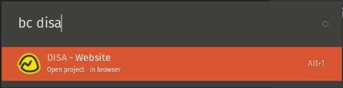

# Basecamp Extension

Open Basecamp projects in browser quickly using [Basecamp](https://basecamp.com/). Based on [basecampy3](https://github.com/phistrom/basecampy3).



## Supported options

- `bc`: list all projects 
- `bc word`: list all project matching `word`

## Setup

This project uses Basecamp 3 API to set it up, please install and configure Basecampy3 to make it work.
```
pip install basecampy3
bc3 configure
```
